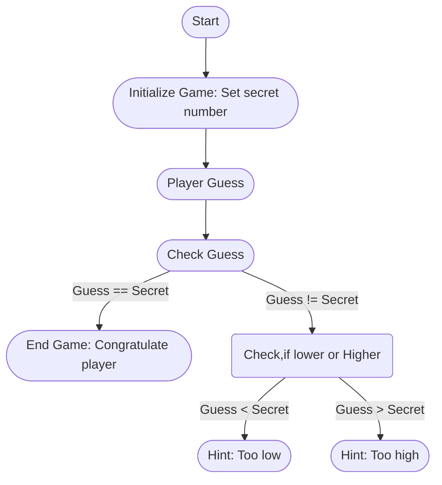

> [!IMPORTANT]
> This file is a draft and subject to major changes.

# Control Flow

## Recap

1. pfhaupt/slides -> Recap (Ordnerstruktur)
2. Welche (skalaren) Datentypen existieren in Rust?
3. pfhaupt/slides -> Intermission: How a program is executed
4. pfhaupt/slides -> Intermission: Exercise 1

## Shadowing

```rust
fn main() {
    let a = 5;
    let a = 7;

    println!("{a}");
}
```

Shadowed Variablen sind unterschiedliche Variablen.
Daher muss der Datentyp nicht identisch sein.

```rust
fn main() {
    let a = 5;
    let a = false;
    let a = "hello world";

    println!("{a}");
}
```

Popquiz

```rust
fn main() {
    let x = 5;

    let x = x + 1;

    { // <- Mit geschweiften Klammern kann ein gekapselter Bereich („Scope“) erstellt werden
        let x = x * 2;
        println!("The value of x in the inner scope is: {x}");
    }

    println!("The value of x is: {x}");
}
```

## Kommentare

```rust
// Dieser Text wird ignoriert/übersprungen
fn main() {
    println!("hello world");
    // Dieser Text wird auch ignoriert/übersprungen
    println!("goodbye world");
} // alles hinter einem `//` wird ignoriert
```

## Kontrollstrukturen `if` und `else`

Fallunterscheidung

```rust
if a {
    println!("You did it!");
}
```


„Wenn Bedingung `a` erfüllt ist, führe `println!("You did it!")` aus.“

```rust
if a {
    println!("You did it!");
} else {
    println!("You didn't it!");
}
```


„Wenn Bedingung `a` erfüllt ist, führe `println!("You did it!")` aus, sonst führe `println!("You didn't it!")`“ aus.

Formell: (Achtung Denglisch)

Sei `a` eine Value mit Datentyp `boolean`.
Wenn `a` die Value `true` ist, dann führe `println!("You did it!")` aus.
Sonst führe `println!("You didn't it!")` aus.

### Triviale Beispiele

```rust
if true {
    println!("This will always print!");
} else {
    println!("This will never print!");
}
```

### Boolsche Operationen

Nicht triviale Beispiele.

Wir können ein `bool` unter Anderem erzeugen, indem wir zwei Werte vergleichen.

-   `<` „kleiner als“
-   `>` „größer als“
-   `<=` „kleiner gleich“
-   `>=` „größer gleich“
-   `==` „äquivalent“
-   `!=` „nicht äquivalent“

```rust
let a: i32 = 5;
let b: i32 = 10;

let c: bool = a < b;

if c {
    println!("a ist kleiner als b");
} else {
    println!("a ist nicht kleiner als b");
}
```

Hier können wir uns die Variable `c` sparen:

```rust
let a: i32 = 5;
let b: i32 = 10;

if a < b {
    println!("a ist kleiner als b");
} else {
    println!("a ist nicht kleiner als b");
}
```

Was, wenn wir eine ganze Zahl, und eine Fließkommazahl vergleichen wollen?

```rust
let a: f32 = 5.0;
let b: i32 = 10;

let c: bool = a < b; // <- Error: can't compare `{integer}` with `{float}`
```

> Hinweis: Im Terminal sich den Fehler für hilfreiche Hinweise anzeigen lassen

Popquiz: Wie können wir das beheben?

Antwort: „Type Casting“

Wir konvertieren die Ganzzahl in eine Fließkommazahl

```rust
let a: f32 = 5.0;
let b: i32 = 10;

let c: bool = a < (b as f32);
```

Die Klammern können weggelassen werden:

```rust
let c: bool = a < b as f32;
```

### Wie können wir einen String in eine Zahl konvertieren?

Sei `a` eine Variable mit Datentyp `String`.

```rust
let a: String = "67".to_string();
```

> Hinweis: Das `.to_string()` wird benötigt, da `"67"` den Datentyp `&str` („String Slice“) hat.
> Damit konvertiert man ein `&str` in einen `String`.
> String Slices behandeln wir später.

Dann kann `a` wie folgt in eine Zahl konvertiert werden:

```rust
let b: i32 = a.parse().unwrap();
```

Was passiert wenn wir einen String ohne valide Zahl versuchen in eine Zahl zu konvertieren?

```rust
let a: String = "Keine Zahl".to_string();
let b: i32 = a.parse().unwrap();
```

Wir bekommen einen Fehler und unser Programm „panicked“. (Schlecht)

```
thread 'main' panicked at src/main.rs:5:28:
```

Wie man mit Fehlern umgeht, wird später behandelt.
Für den Moment nehmen wir an, dass Eingaben stehts wohlgeformt sind.

> Stichwort `Result` bzw. `Result<T, E>` Datentyp.

## Programming a Guessing Game

We’ll implement a classic beginner programming problem: a guessing game. Here’s how it works: the program will generate a random integer between 1 and 100. It will then prompt the player to enter a guess. After a guess is entered, the program will indicate whether the guess is too low or too high. If the guess is correct, the game will print a congratulatory message and exit.



### Preparation

-   Create a new Cargo Project with cargo new
-   Copy the content of [02_guessing_game/src/main.rs](02_guessing_game/src/main.rs) into the `main.rs` in your Project
