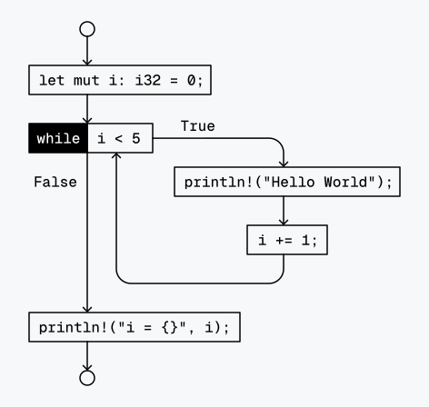
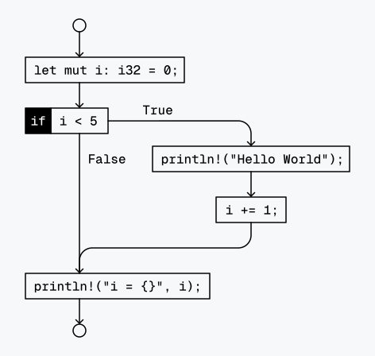
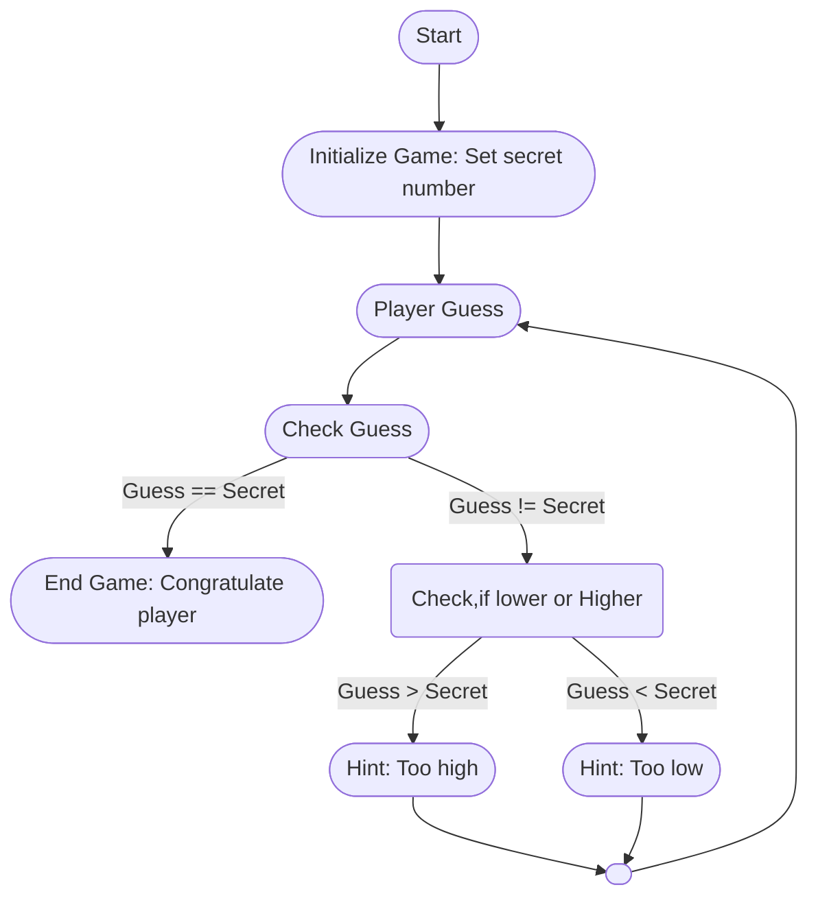

# Loops and Vectors

## Recap

1. We programmed a basic guessing game
2. `if` and `else` clauses
3. Conveting a `String` to a numeric type (e.g. `i32`, `f32`) using `parse()`
4. Boolean operators

## Kontrollstrukturen: `while`

A `while` clause behaves very similar to an `if` clause.
It checks a condition and executes or skips a block of code, depending on whether the condition evaluates to `true` or `false` respectively.
However unlike an `if` clause, which executes the block of code only once, the `while` clause may execute the block of code multiple times or indefinitely.
When the computer reaches the end of a `while` clause (marked by a closing curly brace `}`), it checks the condition again and jumps back to the start if it is `true`.

Let `a` be a boolean.

```rust
while a {
    println!("Repeat this!");
}
```

### Example 1

Let's use a `while` loop to repeat something `5` times.
We can accomplish this by creating a counting variable `i` with the initial value of `0`.

```rust
let mut i: i32 = 0;
while i < 5 {
    println!("Hello World!");
    i += 1;
}
println!("i = {}", i);
```

> [!NOTE]
> Remember that variables in Rust are immutable by default, so instead of `let` we need to use `let mut` to mark the variable as mutable.

**Output**

```console
Hello World!
Hello World!
Hello World!
Hello World!
Hello World!
i = 5
```

**Flowchart**



### Example 2

Compare this to an `if` clause with the same condition, which only runs once.
As a result, `i` gets only incremented once.

```rust
let mut i: i32 = 0;
if i < 5 {
    println!("Hello World!");
    i += 1;
}
println!("i = {}", i);
```

**Output**

```console
Hello World!
i = 1
```

**Flowchart**



## Loop Control using `continue` and `break`

#### `continue`

`continue` statements are exclusively used inside loops. When the program execution reaches a `continue` statement, the program execution immediately jumps back to the start of the loop and reevaluates the loop’s condition. (This is also what happens when the execution reaches the end of the loop.)

```rust
let mut i: i32 = 0;
while i < 5 {
    if i == 2 {
        i += 1;
        continue;
    }
    println!("{}", i);
    i += 1;
}
```

**Output**

```console
0
1
3
4
```

### `break`

Like `continue` statements, `break` statements are used inside loops.
When the execution reaches a break statement, it immediately stops and exits the loop.
Unlike `continue`, the execution does not jump back to beginning of the loop, but instead skips over the rest of the code block and leaves the loop entirely.

```rust
let mut i: i32 = 0;
while i < 5 {
    if i == 2 {
        break;
    }
    println!("{}", i);
    i += 1;
}
```

**Output**

```console
0
1
```

## `loop`

For trivial `while true` loops, we can instead just write `loop`.
The following two code snippets are functionally identical.

```rust
while true {
    println!("Hello World!");
}
```

```rust
loop {
    println!("Hello World!");
}
```

`loop` clauses repeat indefinitely and can only be stopped using the `break` statement.
Of course, `continue` also works as expected, to jump back to the start of the loop early.

### Example 3

The following example is identical to [Example 1](#example-1), but uses `loop` and `break` instead of `while`.

```rust
let mut i = 0;
loop {
    if i == 5 {
        break;
    }
    println!("Hello World!");
    i += 1;
}
println!("i = {}", i);
```

**Output**

```console
Hello World!
Hello World!
Hello World!
Hello World!
Hello World!
i = 5
```

## Improving our Guessing Game

Currently, the player can only guess a single time before the program terminates, no matter if the number was guessed or not.
However we want the player to keep guessing, until they guess the correct number.



Modify your existing code from last exercise to allow for this.

## Arrays and Vectors

See [Slides](https://github.com/pfhaupt/progkurs/blob/master/rust-beginner/03%20-%20Arrays%20and%20Vectors/03%20-%20slides.pdf) by [Philippe Felix Haupt](https://github.com/pfhaupt).

## Exercise

Once again, we extend the guessing game.
We now want to store all guesses the user has made in a Vector and print it at the end of the program when the user guesses the correct number.

> [!NOTE]
> You can use `Vec::new()` to create an empty Vector.
>
> ```rust
> // Like this...
> let mut vec: Vec<i32> = Vec::new();
> // or this...
> let mut vec = Vec::<i32>::new();
>
> ```

> [!NOTE]
> You can use `push` to append items to an array.
>
> ```rust
> let mut vec: Vec<i32> = Vec::new(); // Create empty vector
> vec.push(5); // Append 5
> println!("{:?}", vec); // [5]
> vec.push(22); // Append 22
> println!("{:?}", vec); // [5, 22]
> ```

> [!IMPORTANT]
> Usually variables can be printed using `println!("{}", foo)`, however this does not work for variables of any type.
> To print a variable that is a vector, we need to use `println!("{:?}", foo)`.
> The reasons for this are explained later.
