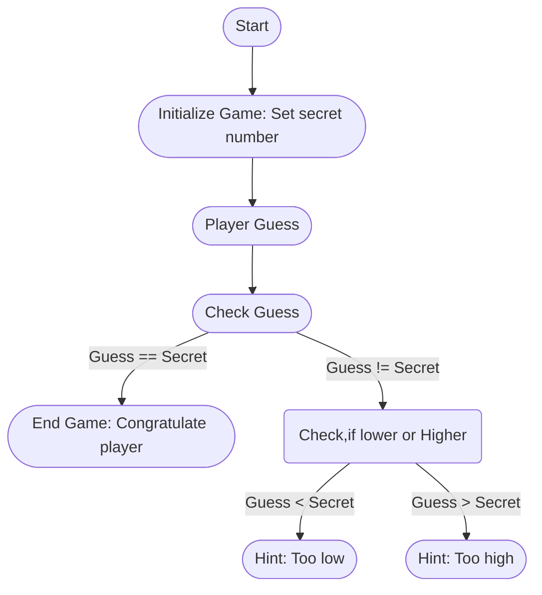

# Guessing Game

We’ll implement a classic beginner programming problem: a guessing game. Here’s how it works: the program will generate a random integer between 1 and 100. It will then prompt the player to enter a guess. After a guess is entered, the program will indicate whether the guess is too low or too high. If the guess is correct, the game will print a congratulatory message and exit.

## Use the [Template!!](02_guessing_game.rs)
- Create a new Cargo Project with cargo new
- Copy the content of [02_guessing_game.rs](02_guessing_game.rs) into the main.rs in your Project

